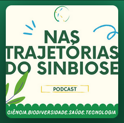

## Missão

**Trajetórias** é uma iniciativa de produção de sínteses científicas para integração do conhecimento a cerca da região Amazônica brasileira, em suas dimensões econômicas, humanas, ecológicas e epidemiológicas. O objetivo é desenvolver métodos para vincular desfechos de saúde aos serviços ecossistêmicos prestados pelo bioma Amazônia, e sua relação com as trajetórias concorrentes de uso da terra. 

Integra o Centro de Sínteses em Biodiversidade do CNPq ([SinBiose](http://www.sinbiose.cnpq.br/web/sinbiose)).  

## Podcast 

Acompanhe o Podcast [*Nas trajetórias do SinBiose*](https://open.spotify.com/show/1hBMRZolQvwUdQy6SnconS)!

Assista entrevistas sobre as análises feitas por nossos pesquisadores sobre as trajetórias observadas na Amazônia. Acaba de ir ao ar o Episódio 3! Impacto Ecológico do Desmatamento na Amazônia,no qual Marcelle Chagas entrevista Cecilia Andreazzi (Fiocruz) e Maria Isabel Escada (INPE).

## Publicações 

### Publicações científicas

Em 2021, publicamos na Frontiers in Public Health, o primeiro artigo de síntese do Trajetórias. Entitulado ["Epidemiology, Biodiversity, and Technological Trajectories in the Brazilian Amazon: From Malaria to COVID-19"](https://doi.org/10.3389/fpubh.2021.647754). Este artigo investiga a distribuição das Trajetórias tecnoprodutivas (TTs) dominantes da Amazônia brasileira e sua associação com degradação ambiental e vulnerabilidade a doenças tropicais negligenciadas. Os resultados desafiam visões simplistas de que a trajetória dominante de desenvolvimento da Amazônia otimizará indicadores econômicos, de saúde e ambientais. Essa abordagem estabelece as bases para uma narrativa mais integrada e consistente com a história econômica da Amazônia brasileira. 

## Equipe 

**Fiocruz:** Claudia T. Codeço, Cecilia Andreazzi, Raquel Lana, Isabel Reis, Tatiana Neves, Milton Barbosa, Marcelle Chagas

**INPE:** Miguel Monteiro, Isabel Escada, Ana Paula dal'Asta, Ana Rorato, Anielli Souza

**UFPA:** Danilo Fernandes 

**UNIFESSPA**: Danuzia Rodrigues

**UFAC:** Monica Silva-Nunes

**Serviço Florestal Brasileiro:** Alexandre Gontijo

**FGV:** Flavio Coelho

## Parceiros

